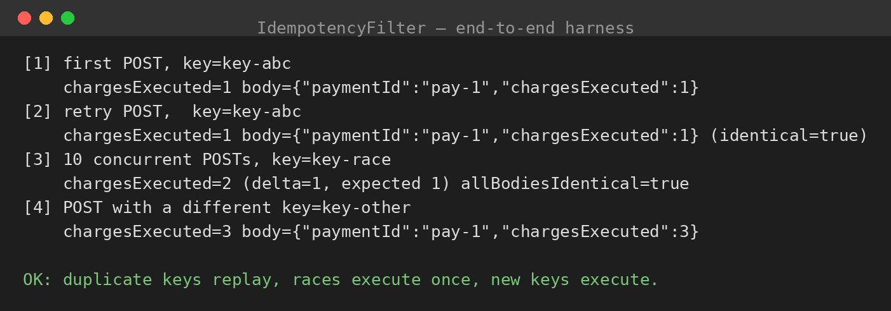

# idempotency-spring

Idempotency-Key handling for Spring Boot, implemented as a `OncePerRequestFilter`.

## The problem

Networks fail, clients time out, users double-click. Every `POST` endpoint you ship will
eventually receive the same request twice. Without idempotency, the second delivery
re-executes the side effect — the customer gets charged twice, the order ships twice.

## The contract

The client generates **one UUID per logical operation** (not per HTTP attempt) and sends it
as the `Idempotency-Key` header. The server guarantees:

- **Seen the key before?** Replay the stored response. The handler never runs again.
- **New key?** Execute normally. If the outcome is successful (2xx), store the response
  under the key for `idempotency.ttl` (default 24h).
- **Two requests racing with the same unseen key?** The loser waits for the winner's
  outcome instead of executing the side effect twice.
- **Failed requests are never cached.** A cached 500 would turn a transient failure into
  a permanent one — failures stay retryable.

## Design decisions

- **Filter, not annotation/interceptor.** A servlet filter sees the raw request/response
  and works for every controller without code changes. `OncePerRequestFilter` guarantees
  single execution even with forwards/includes.
- **Response capture via `ContentCachingResponseWrapper`.** The body is captured
  downstream and only copied to the real response after the caching decision — nothing
  is written twice.
- **First write wins** (`putIfAbsent`). Concurrent duplicates converge on one outcome
  instead of last-write-wins chaos.
- **In-flight futures for the race window.** A `ConcurrentHashMap<String, CompletableFuture>`
  tracks keys currently executing. A duplicate arriving mid-execution waits up to 30s for
  the winner; if the winner hangs or fails, the duplicate executes as a fresh attempt
  rather than deadlocking or inheriting the failure.
- **TTL on every record.** Idempotency records are not forever-data; a background sweeper
  plus lazy expiry on read keeps the store bounded.
- **Pluggable store.** `IdempotencyStore` is an interface. The in-memory implementation
  is for dev/tests — in production, back it with Redis (`SET key value NX EX ttl`) or a
  DB table with a unique constraint on the key.

## Limitations (stated plainly)

- **Not for streaming/SSE endpoints.** The filter buffers the full response via
  `ContentCachingResponseWrapper` to decide what to cache. Exclude streaming paths
  with `shouldNotFilter` (override it for your streaming URL patterns).
- **Single-instance store by default.** The in-memory store doesn't coordinate across
  instances — that's what the Redis variant is for.
- **No request-body hashing.** Two different bodies with the same key are treated as
  the same operation (first write wins). If you need body-mismatch detection, hash the
  body into the stored record and compare on replay.

## Project structure

```
src/main/java/com/ajay/idempotency/
  IdempotencyFilter.java          # the OncePerRequestFilter (the core of this repo)
  IdempotencyStore.java           # storage contract
  InMemoryIdempotencyStore.java   # ConcurrentHashMap + TTL + background sweeper
  StoredResponse.java             # status + content-type + body, replayed verbatim
  demo/
    IdempotencyDemoApplication.java
    PaymentController.java        # fake charge endpoint with an execution counter
src/test/java/.../InMemoryIdempotencyStoreTest.java
```

## Build & run

Requires Java 17+ and Maven (deps download from Maven Central on first build).

```bash
mvn spring-boot:run
```

## Demo

In one terminal, start the app. In another:

```bash
KEY=$(uuidgen)

# First request: executes the side effect (chargesExecuted: 1)
curl -s -X POST localhost:8080/payments \
  -H "Content-Type: application/json" \
  -H "Idempotency-Key: $KEY" \
  -d '{"amount": 2500}'

# Retry with the SAME key: replayed, side effect NOT re-executed (chargesExecuted still 1)
curl -s -X POST localhost:8080/payments \
  -H "Content-Type: application/json" \
  -H "Idempotency-Key: $KEY" \
  -d '{"amount": 2500}'

# Different key: a genuinely new operation, executes again
curl -s -X POST localhost:8080/payments \
  -H "Content-Type: application/json" \
  -H "Idempotency-Key: $(uuidgen)" \
  -d '{"amount": 2500}'
```

Both responses to the first key return the same `paymentId` — proof the second call
was a replay, not a re-execution.

## Results



The screenshot shows the actual filter and store from this repo exercised end to end
(no mocks in the code under test): a retried key replays the stored response without
re-executing (`chargesExecuted` stays at 1, identical body), ten threads racing with
the same unseen key produce exactly one execution with identical responses, and a new
key executes normally. (Captured via a servlet test harness driving the real
`IdempotencyFilter`; the full Spring Boot app itself needs Maven Central access —
run `mvn spring-boot:run` on any connected machine for the live curl demo above.)

Run the unit tests with `mvn test`.
